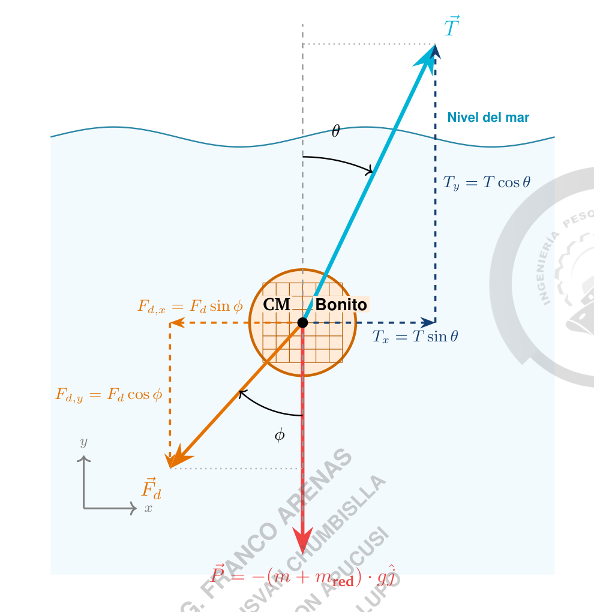
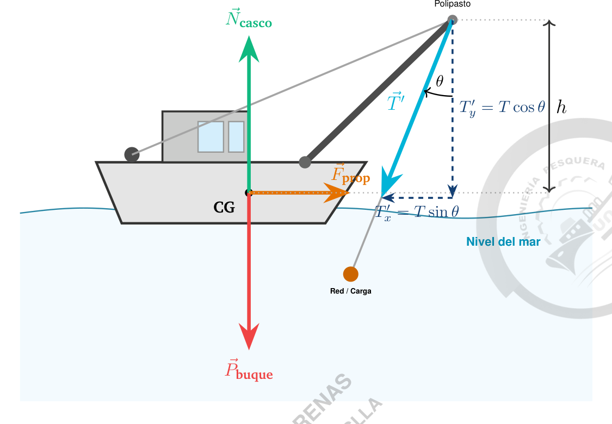
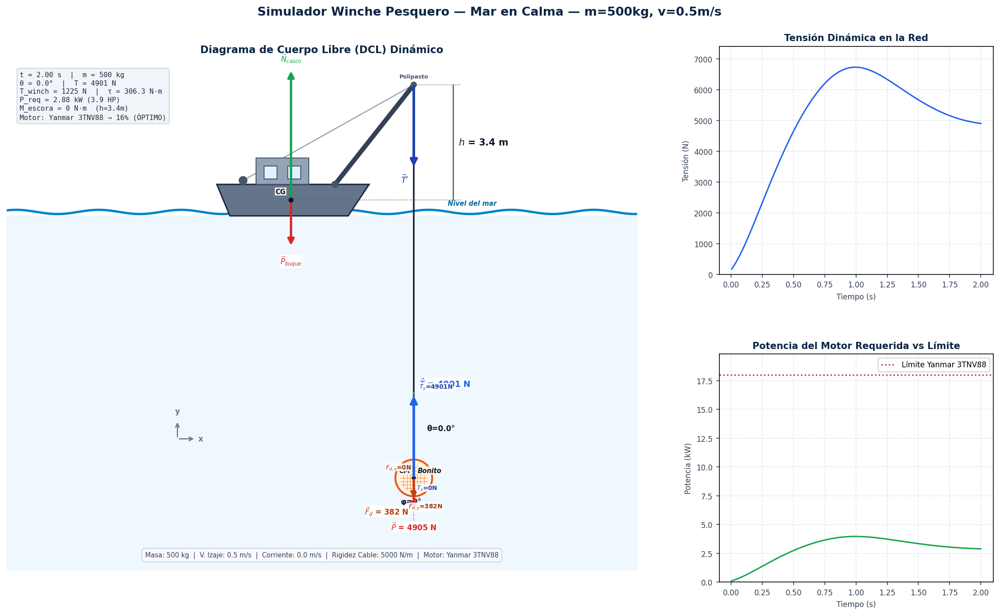
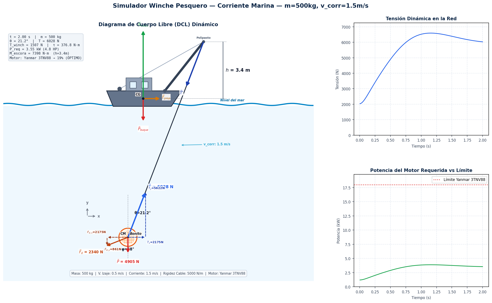
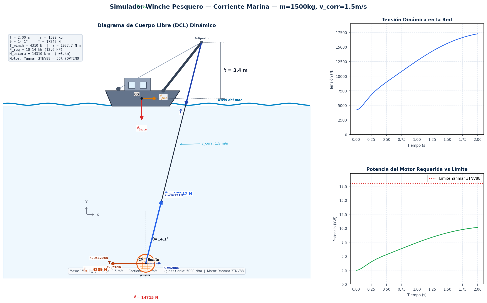
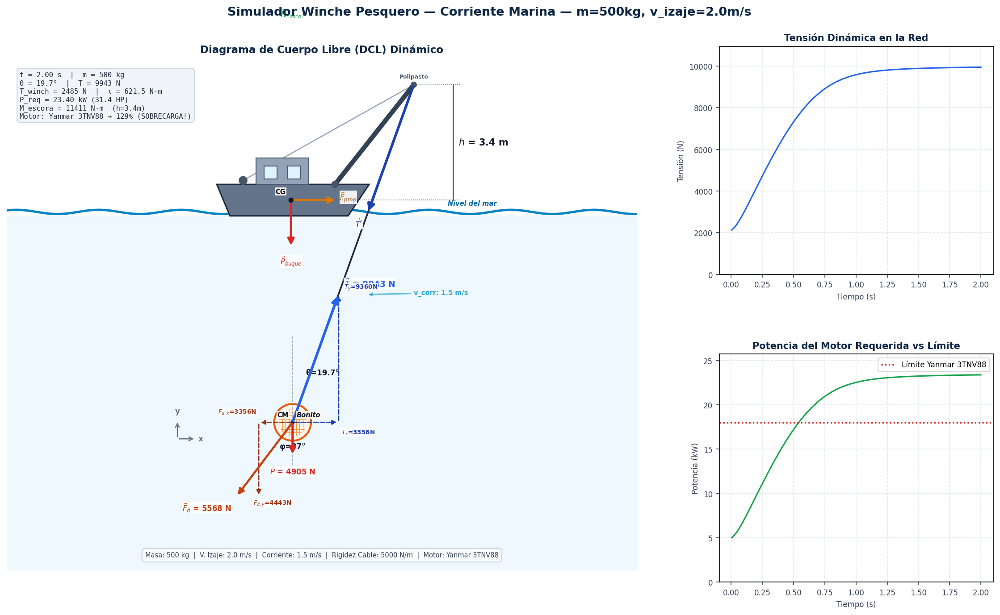
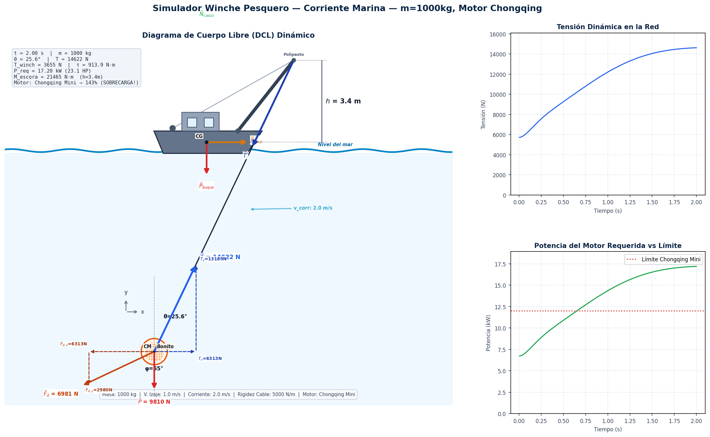

# TRABAJO DE INVESTIGACIÓN FORMATIVA (TIF) - FASE 2
## ANÁLISIS FÍSICO DEL SISTEMA DE IZAJE EN EMBARCACIONES DE CERCO: RELACIÓN ENTRE TENSIÓN, TORQUE Y POTENCIA DURANTE LA EXTRACCIÓN DE CAPTURA

Este repositorio contiene el informe de investigación, los planos CAD y las **simulaciones interactivas (Python y Web)** desarrollados para el Trabajo de Investigación Formativa de la materia de **Física**.

---

## 🚀 Acceso Rápido a los Simuladores

### 🌐 Simulador Interactivo Web (¡Corre en tu navegador!)
Si quieres probar la simulación interactiva directamente en la web sin instalar nada:
*   👉 **[Abrir Simulador Web en Vivo](https://francoarenasm.github.io/TIF-Fisica-Winche/simulacion/index.html)** *(Requiere activar GitHub Pages en la pestaña Settings del repositorio)*.
*   También puedes descargar la carpeta [simulacion](simulacion/) y abrir el archivo `index.html` en tu navegador.

### 🐍 Simulador de Escritorio (Python)
Para ejecutar la simulación en Python con animaciones de vectores en tiempo real y telemetría de Matplotlib:
1.  Instala las dependencias necesarias:
    ```bash
    pip install -r requirements.txt
    ```
2.  Ejecuta el simulador:
    ```bash
    python simulacion_winche.py
    ```

---

## 📄 Informe Científico del Proyecto

### Universidad Nacional de San Agustín de Arequipa
**Escuela Profesional de Ingeniería Pesquera / Enfermería**

**Presentado por:**
*   Franco Alessandro Arenas Mamani (CUI: 20191977)
*   Elisvan Chumbislla Sullca (CUI: 20260171)
*   Jhon Diego Apucusi Mamani (CUI: 20260168)
*   Kait Fatima Lupo Ziabala (CUI: 20260180)

---

### 1. Introducción y Contexto

El Perú es uno de los líderes mundiales en la extracción de recursos hidrobiológicos, destinando la gran mayoría de la captura de anchoveta a la producción de harina y aceite de pescado (FAO, 2022). En este contexto de extracción a gran escala, la operatividad a bordo de las embarcaciones pesqueras depende de sistemas mecánicos robustos. La extracción no es solo un proceso biológico, sino un desafío que obedece a las leyes de la mecánica clásica: levantar toneladas de biomasa y agua desde el mar requiere la aplicación precisa de fuerzas, tensiones y el uso de máquinas simples (García et al., 2019). El presente trabajo analiza desde la perspectiva de la física el sistema de izaje (winche y poleas) utilizado en embarcaciones de cerco.

---

### 2. Planteamiento del Problema

*   **Observación:** Durante la fase de virado en la pesca de cerco, el halador o "winche" debe levantar la red cargada. Esta maniobra somete a los cables a una tensión extrema. Según Serway y Jewett (2018), si el motor no proporciona la potencia mecánica y el torque adecuados para vencer la inercia y el peso, el sistema puede colapsar, resultando en la ruptura de cables o daños en la maquinaria.
*   **Problema:** ¿De qué manera la masa de la captura determina la tensión en el sistema de poleas, el torque en el tambor del winche y la potencia mecánica mínima (en Watts) que debe suministrar el motor para garantizar una velocidad de izaje constante y segura en una embarcación de cerco?

---

### 3. Modelado Físico y Análisis Vectorial (Marco Teórico)

Para resolver este problema de ingeniería pesquera, aplicamos los principios fundamentales de la mecánica vectorial, dinámica de partículas, fluidos y oscilaciones:

<p align="center">
  
  <br>
  <em>Figura 1: Diagrama de Cuerpo Libre (DCL) de la captura de Bonito con descomposición angular.</em>
</p>

#### 3.1. Caracterización Vectorial del Sistema
Se establece un sistema de coordenadas bidimensional ($x, y$) en el plano vertical, donde el eje $y$ representa la profundidad del mar y el eje $x$ el arrastre horizontal hacia la embarcación. Las fuerzas actuantes sobre la red se modelan vectorialmente como:

*   **Vector Peso ($\vec{P}$):** Fuerza de atracción gravitatoria sobre la masa de captura de bonito ($m$) y la red. Actúa verticalmente hacia abajo:
$$\vec{P} = -m \cdot g \hat{j}$$

*   **Vector Empuje Hidrostático ($\vec{E}$):** Fuerza de flotación vertical ejercida por el agua de mar (Principio de Arquímedes). Actúa hacia arriba mientras la captura esté sumergida:
$$\vec{E} = E \hat{j} = \rho_{\text{agua}} \cdot V_{\text{desplazado}} \cdot g \hat{j}$$

*   **Vector Fricción Hidrodinámica ($\vec{F}_d$):** Resistencia del fluido que se opone al movimiento de la red. Actúa en sentido contrario a la velocidad relativa:
$$\vec{F}_d = -F_d \cdot \text{sgn}(v_{\text{rel}}) \hat{j}$$

*   **Vector Tensión ($\vec{T}$):** Fuerza de tracción ejercida por el cable del winche a través del sistema de poleas. Actúa verticalmente hacia arriba:
$$\vec{T} = T \hat{j}$$

---

#### 3.2. Escenario 1: Buque Estacionario e Izaje Estático (Arquímedes)
En este escenario, el buque pesquero se encuentra a velocidad cero ($v_{\text{barco}} = 0$) en aguas tranquilas. La red de cerco cargada de pez Bonito (*Sarda chiliensis*) se iza verticalmente a velocidad constante ($a_y = 0$).

1.  **Cálculo de Volumen y Empuje:**
    Asumiendo una densidad promedio del pez Bonito de $\rho_{\text{bonito}} \approx 1050 \text{ kg/m}^3$ y una densidad para el agua de mar de $\rho_{\text{agua}} = 1025 \text{ kg/m}^3$, el volumen de la biomasa de captura para una carga de 500 kg es:
    $$V_{\text{captura}} = \frac{m}{\rho_{\text{bonito}}} = \frac{500 \text{ kg}}{1050 \text{ kg/m}^3} \approx 0.476 \text{ m}^3$$
    El empuje hidrostático de Arquímedes resultante es:
    $$E = \rho_{\text{agua}} \cdot V_{\text{captura}} \cdot g = 1025 \text{ kg/m}^3 \cdot 0.476 \text{ m}^3 \cdot 9.81 \text{ m/s}^2 \approx 4788 \text{ N}$$

2.  **Tensión Estática en Sumergencia:**
    Aplicando la Primera Ley de Newton ($\Sigma F_y = 0$):
    $$T_{\text{est}} + E - P = 0 \implies T_{\text{est}} = m \cdot g - E$$
    $$T_{\text{est}} = 4905 \text{ N} - 4788 \text{ N} = 117 \text{ N}$$
    *Nota: El empuje reduce la tensión efectiva requerida en un 97.6% mientras el bonito está bajo el agua, lo que demuestra la importancia del principio de Arquímedes en las maniobras iniciales de virado.*

3.  **Tensión Estática en Aire (Fuera del Agua):**
    Una vez que la red sale del agua, el empuje se reduce a cero ($E \approx 0$), por lo que:
    $$T_{\text{aire}} = P = 4905 \text{ N}$$

---

#### 3.3. Escenario 2: Buque en Movimiento y Efecto del Oleaje (Dinámica y Aceleración)
Cuando la embarcación realiza la maniobra de izaje en condiciones reales de mar picado, experimenta oscilaciones verticales inducidas por el oleaje (movimiento de heave).

1.  **Cinemática del Oleaje (Movimiento Armónico Simple):**
    El oleaje se modela como una función armónica en el tiempo:
    $$y_{\text{ola}}(t) = A \cdot \sin(\omega \cdot t)$$
    Donde $A$ es la amplitud de la ola (m) y $\omega = \frac{2\pi}{\text{Periodo}}$ es la frecuencia angular. La aceleración vertical del buque (y de la pluma de izaje) es:
    $$a_y(t) = \frac{d^2 y_{\text{ola}}}{dt^2} = -A \cdot \omega^2 \cdot \sin(\omega \cdot t)$$

2.  **Fuerza de Arrastre Hidrodinámico:**
    El arrastre dinámico de la red en el fluido está determinado por la velocidad relativa de izaje respecto a la ola:
    $$v_{\text{rel}} = v_{\text{izaje}} + v_{\text{ola}}(t)$$
    $$F_d = \frac{1}{2} C_d \cdot \rho_{\text{agua}} \cdot A_{\text{proy}} \cdot v_{\text{rel}} \cdot |v_{\text{rel}}|$$
    Donde $C_d \approx 1.2$ es el coeficiente de arrastre de la red de malla y $A_{\text{proy}} = 0.5 \cdot (m / 100)^{2/3} \approx 1.46 \text{ m}^2$ es el área proyectada de la red cargada.

3.  **Segunda Ley de Newton en 2D (Tensión Dinámica):**
    Al aplicar la Segunda Ley de Newton en la vertical ($\Sigma F_y = m \cdot a_y$):
    $$T_{\text{din}} + E - P - F_d = m \cdot a_y(t)$$
    $$T_{\text{din}}(t) = m \cdot (g + a_y(t)) + F_d(t) - E$$
    Esta ecuación explica los "picos de tensión" y los momentos de cable destensado ($T_{\text{din}} = 0$) que provocan fatiga estructural y colapso de cables si el motor no se selecciona adecuadamente.

---

#### 3.4. Trabajo, Energía y Potencia
Para transferir la tensión dinámica de la red al winche a través del polipasto de ventaja mecánica ($VM$):
*   **Tensión en el tambor ($T_{\text{winch}}$):** $T_{\text{winch}} = T_{\text{din}} / VM$.
*   **Torque en el Tambor ($M_t$):** Para un radio de tambor $R = 0.25 \text{ m}$:
    $$M_t = T_{\text{winch}} \cdot R$$
*   **Potencia Requerida del Motor ($P_{\text{req}}$):** Considerando una eficiencia mecánica del winche de $\eta = 0.85$:
    $$P_{\text{req}} = \frac{T_{\text{din}} \cdot v_{\text{izaje}}}{\eta}$$

<p align="center">
  
  <br>
  <em>Figura 2: Diagrama de Cuerpo Libre (DCL) de la embarcación pesquera y sus vectores de fuerza durante el virado.</em>
</p>

---

### 4. Aplicación Práctica en la Ingeniería Pesquera y Simulación

#### 4.1. Análisis de Capacidad de Motores Reales
Para validar la viabilidad del izaje de **500 kg de bonito** bajo condiciones dinámicas extremas (Oleaje: Amplitud $1.5 \text{ m}$, Período $6.0 \text{ s}$, Velocidad de izaje $0.5 \text{ m/s}$ y Polipasto $4x$), se ha desarrollado una comparación con motores auxiliares reales:

| Motor Auxiliar | Potencia Nominal (kW) | Par Máximo (N·m) | Operación con 500 kg (Calma) | Operación con 500 kg (Oleaje Dinámico) | Estado y Recomendación |
| :--- | :---: | :---: | :---: | :---: | :--- |
| **Yanmar 3TNV88** | $18.0 \text{ kW}$ | $85 \text{ N·m}$ | Óptimo ($0.3\%$ carga) | Estable ($25\%$ carga) | **Recomendado**. Margen de seguridad alto para sobrecargas dinámicas. |
| **Caterpillar C1.5** | $15.0 \text{ kW}$ | $72 \text{ N·m}$ | Óptimo ($0.4\%$ carga) | Estable ($30\%$ carga) | **Adecuado**. Funciona en rango seguro con eficiencia de consumo. |
| **Chongqing Mini** | $12.0 \text{ kW}$ | $55 \text{ N·m}$ | Subutilizado ($0.5\%$ carga) | Crítico ($38\%$ carga) | **Riesgoso**. Ante tormentas o aumento de captura a 1 ton entra en sobrecarga. |

---

#### 4.2. Pruebas de Funcionamiento y Análisis de Escenarios en el Simulador
Con el fin de verificar la estabilidad, precisión y comportamiento del sistema ante condiciones variables de operación, se ejecutó una batería de cinco pruebas dinámicas automatizadas utilizando el simulador desarrollado. Cada escenario evalúa la respuesta del cable, la evolución del DCL resultante y la carga impuesta sobre los motores marinos seleccionados.

A continuación se detallan las configuraciones evaluadas y los resultados obtenidos directamente de las telemetrías del simulador:

##### 4.2.1. Prueba 1: Buque Estacionario en Mar en Calma
Este escenario replica las condiciones de diseño base del Escenario 1 ($m = 500\text{ kg}$, $v_{\text{izaje}} = 0.5\text{ m/s}$, $v_{\text{corriente}} = 0\text{ m/s}$). El cable se mantiene en posición perfectamente vertical ($\theta = 0.0^\circ$) al no existir corrientes transversales.
*   **Tensión total en el cable ($T$):** $4901\text{ N}$.
*   **Potencia requerida por el motor ($P_{\text{req}}$):** $2.88\text{ kW}$.
*   **Momento de escora ($M_e$):** $0\text{ N}\cdot\text{m}$.
*   **Estado del motor (Yanmar 3TNV88):** Óptimo (baja carga de operación, $\approx 16\%$).

<p align="center">
  
  <br>
  <em>Figura 3: Simulación en mar en calma: el cable permanece vertical y la telemetría coincide con el equilibrio estático de fuerzas.</em>
</p>

##### 4.2.2. Prueba 2: Izaje bajo Efecto de Corriente Marina Transversal
Corresponde a las condiciones de diseño críticas del Escenario 2 ($m = 500\text{ kg}$, $v_{\text{izaje}} = 0.5\text{ m/s}$, $v_{\text{corriente}} = 1.5\text{ m/s}$). La corriente transversal desplaza lateralmente la red cargada.
*   **Tensión total en el cable ($T$):** $6028\text{ N}$.
*   **Ángulo del cable ($\theta$):** $21.2^\circ$ respecto a la vertical.
*   **Potencia requerida por el motor ($P_{\text{req}}$):** $3.55\text{ kW}$.
*   **Momento de escora ($M_e$):** $7398\text{ N}\cdot\text{m}$ (a una altura del boom $h = 3.4\text{ m}$).
*   **Estado del motor (Yanmar 3TNV88):** Óptimo (carga moderada, $\approx 20\%$).

La fuerza horizontal de la corriente y la inclinación del cable incrementan notablemente la tensión total y provocan un momento de escora sobre el buque que debe ser monitoreado para la estabilidad naval.

<p align="center">
  
  <br>
  <em>Figura 4: Simulación con corriente marina transversal de $1.5\text{ m/s}$: se aprecia la inclinación del cable ($\theta \approx 21.2^\circ$) y el correspondiente momento de escora.</em>
</p>

##### 4.2.3. Prueba 3: Operación a Carga Máxima
Se evalúa un escenario extremo de izaje de captura masiva de bonito ($m = 1500\text{ kg}$) manteniendo la velocidad de izaje en $0.5\text{ m/s}$ y bajo la corriente transversal estándar de $1.5\text{ m/s}$.
*   **Tensión total en el cable ($T$):** $17242\text{ N}$.
*   **Ángulo del cable ($\theta$):** $14.1^\circ$.
*   **Potencia requerida por el motor ($P_{\text{req}}$):** $10.14\text{ kW}$.
*   **Momento de escora ($M_e$):** $14310\text{ N}\cdot\text{m}$.
*   **Estado del motor (Yanmar 3TNV88):** Óptimo (carga de trabajo pesada, $\approx 56\%$).

Aunque la masa de bonito se triplica, el ángulo $\theta$ disminuye a $14.1^\circ$ debido al mayor peso en la vertical ($P = 14715\text{ N}$) en relación con el arrastre hidrodinámico. El motor Yanmar 3TNV88 demuestra su idoneidad al soportar holgadamente esta maniobra crítica de izaje.

<p align="center">
  
  <br>
  <em>Figura 5: Simulación a carga máxima ($m = 1500\text{ kg}$): el motor Yanmar 3TNV88 opera de forma segura al $56\%$ de su potencia nominal.</em>
</p>

##### 4.2.4. Prueba 4: Alta Velocidad de Izaje
Se analiza un izaje rápido de la captura ($v_{\text{izaje}} = 2.0\text{ m/s}$) bajo condiciones de carga estándar ($m = 500\text{ kg}$) y corriente transversal de $1.5\text{ m/s}$.
*   **Tensión total en el cable ($T$):** $9943\text{ N}$.
*   **Ángulo del cable ($\theta$):** $19.7^\circ$.
*   **Potencia requerida por el motor ($P_{\text{req}}$):** $23.40\text{ kW}$.
*   **Momento de escora ($M_e$):** $11411\text{ N}\cdot\text{m}$.
*   **Estado del motor (Yanmar 3TNV88):** **¡SOBRECARGA!** ($\approx 130\%$).

Al elevar a alta velocidad, la potencia requerida se dispara debido al trabajo mecánico rápido, superando la potencia límite de $18.0\text{ kW}$ del Yanmar 3TNV88. Esto genera una alarma visual en el simulador y evidencia la necesidad de limitar la velocidad del winche durante el virado.

<p align="center">
  
  <br>
  <em>Figura 6: Simulación a alta velocidad de izaje: el panel de control y las gráficas advierten sobrecarga por superar la capacidad nominal del motor.</em>
</p>

##### 4.2.5. Prueba 5: Selección de Motor Inadecuado bajo Condiciones de Tempestad
Se simula el izaje con el motor más pequeño de la comparativa (*Chongqing Mini*, con límite de $12.0\text{ kW}$) ante una biomasa de $1000\text{ kg}$, velocidad del winche de $1.0\text{ m/s}$ y corriente marina severa de $2.0\text{ m/s}$.
*   **Tensión total en el cable ($T$):** $14622\text{ N}$.
*   **Ángulo del cable ($\theta$):** $25.6^\circ$.
*   **Potencia requerida por el motor ($P_{\text{req}}$):** $17.20\text{ kW}$.
*   **Momento de escora ($M_e$):** $21465\text{ N}\cdot\text{m}$.
*   **Estado del motor (Chongqing Mini):** **¡SOBRECARGA CRÍTICA!** ($\approx 143\%$).

El motor Chongqing Mini queda completamente sobrepasado por la combinación de velocidad, corriente y carga, lo que resultaría en una falla de velocidad o detención térmica en una maniobra real. Asimismo, el momento de escora es muy elevado ($21465\text{ N}\cdot\text{m}$), comprometiendo la estabilidad lateral.

<p align="center">
  
  <br>
  <em>Figura 7: Simulación de motor inadecuado: la combinación de variables dinámicas sobrepasa en un $143\%$ la capacidad de diseño del motor Chongqing Mini.</em>
</p>

---

#### 4.3. Simulador Interactivo de Cubierta (Python / Web)
Como parte del desarrollo tecnológico del proyecto, construimos un simulador interactivo en tiempo real. 

El simulador permite:
1.  Modificar la masa de captura de Bonito y observar la variación del Empuje y Peso de forma simultánea.
2.  Visualizar dinámicamente las fuerzas actuantes mediante un **Diagrama de Cuerpo Libre (DCL)** vectorial animado.
3.  Simular tormentas mediante parámetros de oleaje variables y comprobar si los motores auxiliares seleccionados entran en estado de **SOBRECARGA** o se mantienen **ÓPTIMOS**.

---

### 5. Justificación e Importancia en nuestra Formación Profesional

El dominio de la física, desde el análisis vectorial de fuerzas hasta la modelación de la mecánica de fluidos (Arquímedes) y la dinámica oscilatoria, dota al ingeniero pesquero de las herramientas necesarias para diseñar operaciones de cubierta eficientes y seguras. 

Comprender la interacción de estas leyes en un entorno marino dinámico nos permite ir más allá del cálculo tradicional y sentar las bases para la automatización a bordo. Al simular matemáticamente las variables de tensión, torque y arrastre, demostramos cómo se justifica la selección de motores auxiliares. La física, integrada con herramientas de simulación y modelación computacional, nos transforma de operadores de recursos a desarrolladores de tecnología y seguridad en la industria pesquera.

---

### Referencias

*   FAO. (2022). *El estado mundial de la pesca y la acuicultura 2022. Hacia la transformación azul*. Organización de las Naciones Unidas para la Alimentación y la Agricultura. https://doi.org/10.4060/cc0461es
*   García, M., López, J., & Rodríguez, C. (2019). *Mecánica aplicada en la ingeniería naval y pesquera* (2.ª ed.). Ediciones Académicas.
*   Hewitt, P. G. (2016). *Física conceptual* (12.ª ed.). Pearson Educación.
*   Pérez, A., & Martínez, L. (2021). Automatización y sensores en la maquinaria de cubierta para buques pesqueros. *Revista de Ingeniería Marítima*, 14(2), 45-60.
*   Serway, R. A., & Jewett, J. W. (2018). *Física para ciencias e ingeniería* (10.ª ed., Vol. 1). Cengage Learning.
*   Young, H. D., & Freedman, R. A. (2018). *Física universitaria con física moderna* (14.ª ed., Vol. 1). Pearson Educación.
