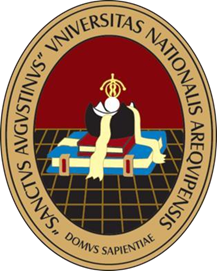
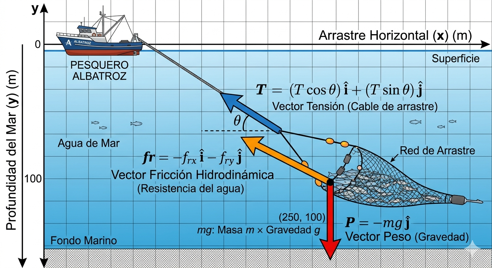
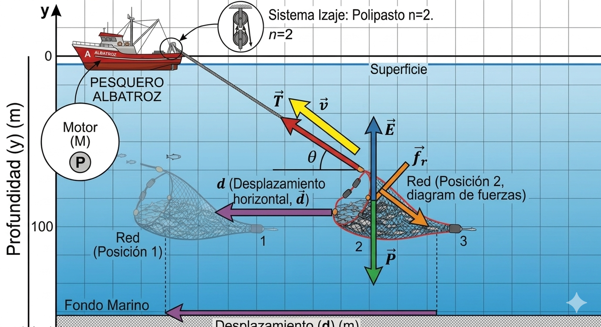
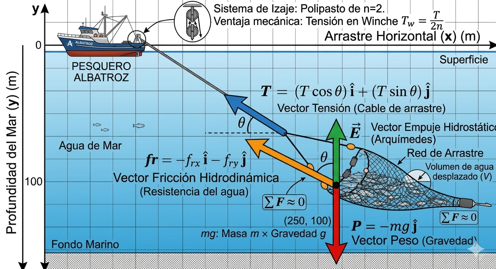

# TRABAJO DE INVESTIGACIÓN FORMATIVA (TIF) - FASE 2
## ANÁLISIS FÍSICO DEL SISTEMA DE IZAJE EN EMBARCACIONES DE CERCO: RELACIÓN ENTRE TENSIÓN, TORQUE Y POTENCIA DURANTE LA EXTRACCIÓN DE CAPTURA

Este repositorio contiene el informe de investigación, los planos CAD y las **simulaciones interactivas (Python y Web)** desarrollados para el Trabajo de Investigación Formativa de la materia de **Física**.

---

## 🚀 Acceso Rápido a los Simuladores

### 🌐 Simulador Interactivo Web (¡Corre en tu navegador!)
Si quieres probar la simulación interactiva directamente en la web sin instalar nada:
*   👉 **[Abrir Simulador Web en Vivo](https://francoarenasm.github.io/TIF-Fisica-Winche/simulacion/index.html)** *(Requiere activar GitHub Pages en la pestaña Settings del repositorio)*.
*   También puedes descargar la carpeta [simulacion](simulacion/) y abrir el archivo `index.html` en tu navegador.

### 🐍 Simulador de Escritorio (Python)
Para ejecutar la simulación en Python con animaciones de vectores en tiempo real y telemetría de Matplotlib:
1.  Instala las dependencias necesarias:
    ```bash
    pip install -r requirements.txt
    ```
2.  Ejecuta el simulador:
    ```bash
    python simulacion_winche.py
    ```

---

## 📄 Informe Científico del Proyecto

### Universidad Nacional de San Agustín de Arequipa
**Escuela Profesional de Ingeniería Pesquera / Enfermería**

**Presentado por:**
*   Franco Alessandro Arenas Mamani (CUI: 20191977)
*   Elisvan Chumbislla Sullca (CUI: 20260171)
*   Jhon Diego Apucusi Mamani (CUI: 20260168)
*   Kait Fatima Lupo Ziabala (CUI: 20260180)

---

### 1. Introducción y Contexto

El Perú es uno de los líderes mundiales en la extracción de recursos hidrobiológicos, destinando la gran mayoría de la captura de anchoveta a la producción de harina y aceite de pescado (FAO, 2022). En este contexto de extracción a gran escala, la operatividad a bordo de las embarcaciones pesqueras depende de sistemas mecánicos robustos. La extracción no es solo un proceso biológico, sino un desafío que obedece a las leyes de la mecánica clásica: levantar toneladas de biomasa y agua desde el mar requiere la aplicación precisa de fuerzas, tensiones y el uso de máquinas simples (García et al., 2019). El presente trabajo analiza desde la perspectiva de la física el sistema de izaje (winche y poleas) utilizado en embarcaciones de cerco.

---

### 2. Planteamiento del Problema

*   **Observación:** Durante la fase de virado en la pesca de cerco, el halador o "winche" debe levantar la red cargada. Esta maniobra somete a los cables a una tensión extrema. Según Serway y Jewett (2018), si el motor no proporciona la potencia mecánica y el torque adecuados para vencer la inercia y el peso, el sistema puede colapsar, resultando en la ruptura de cables o daños en la maquinaria.
*   **Problema:** ¿De qué manera la masa de la captura determina la tensión en el sistema de poleas, el torque en el tambor del winche y la potencia mecánica mínima (en Watts) que debe suministrar el motor para garantizar una velocidad de izaje constante y segura en una embarcación de cerco?

---

### 3. Modelado Físico y Análisis Vectorial (Marco Teórico)

Para resolver este problema de ingeniería pesquera, aplicamos los principios fundamentales de la mecánica vectorial, dinámica de partículas, fluidos y oscilaciones:

<p align="center">
  
  <br>
  <em>Figura 1: Esquema de fuerzas dinámicas en el tambor de arrollamiento (Tensión F, velocidad angular $\omega$, torque $M_t$ y diámetro del tambor).</em>
</p>

#### 3.1. Caracterización Vectorial del Sistema
Se establece un sistema de coordenadas bidimensional ($x, y$) en el plano vertical, donde el eje $y$ representa la profundidad del mar y el eje $x$ el arrastre horizontal hacia la embarcación. Las fuerzas actuantes sobre la red se modelan vectorialmente como:
*   **Vector Peso ($\vec{P}$):** Fuerza de atracción gravitatoria sobre la masa de captura de bonito ($m$) y la red. Actúa verticalmente hacia abajo: $\vec{P} = -m \cdot g \hat{j}$
*   **Vector Empuje Hidrostático ($\vec{E}$):** Fuerza de flotación vertical ejercida por el agua de mar (Principio de Arquímedes). Actúa hacia arriba mientras la captura esté sumergida: $\vec{E} = E \hat{j} = \rho_{\text{agua}} \cdot V_{\text{desplazado}} \cdot g \hat{j}$
*   **Vector Fricción Hidrodinámica ($\vec{F}_d$):** Resistencia del fluido que se opone al movimiento de la red. Actúa en sentido contrario a la velocidad relativa: $\vec{F}_d = -F_d \cdot \text{sgn}(v_{\text{rel}}) \hat{j}$
*   **Vector Tensión ($\vec{T}$):** Fuerza de tracción ejercida por el cable del winche a través del sistema de poleas. Actúa verticalmente hacia arriba: $\vec{T} = T \hat{j}$

---

#### 3.2. Escenario 1: Buque Estacionario e Izaje Estático (Arquímedes)
En este escenario, el buque pesquero se encuentra a velocidad cero ($v_{\text{barco}} = 0$) en aguas tranquilas. La red de cerco cargada de pez Bonito (*Sarda chiliensis*) se iza verticalmente a velocidad constante ($a_y = 0$).

1.  **Cálculo de Volumen y Empuje:**
    Asumiendo una densidad promedio del pez Bonito de $\rho_{\text{bonito}} \approx 1050 \text{ kg/m}^3$ y una densidad para el agua de mar de $\rho_{\text{agua}} = 1025 \text{ kg/m}^3$, el volumen de la biomasa de captura para una carga de 500 kg es:
    $$V_{\text{captura}} = \frac{m}{\rho_{\text{bonito}}} = \frac{500 \text{ kg}}{1050 \text{ kg/m}^3} \approx 0.476 \text{ m}^3$$
    El empuje hidrostático de Arquímedes resultante es:
    $$E = \rho_{\text{agua}} \cdot V_{\text{captura}} \cdot g = 1025 \text{ kg/m}^3 \cdot 0.476 \text{ m}^3 \cdot 9.81 \text{ m/s}^2 \approx 4788 \text{ N}$$

2.  **Tensión Estática en Sumergencia:**
    Aplicando la Primera Ley de Newton ($\Sigma F_y = 0$):
    $$T_{\text{est}} + E - P = 0 \implies T_{\text{est}} = m \cdot g - E$$
    $$T_{\text{est}} = 4905 \text{ N} - 4788 \text{ N} = 117 \text{ N}$$
    *Nota: El empuje reduce la tensión efectiva requerida en un 97.6% mientras el bonito está bajo el agua, lo que demuestra la importancia del principio de Arquímedes en las maniobras iniciales de virado.*

3.  **Tensión Estática en Aire (Fuera del Agua):**
    Una vez que la red sale del agua, el empuje se reduce a cero ($E \approx 0$), por lo que:
    $$T_{\text{aire}} = P = 4905 \text{ N}$$

---

#### 3.3. Escenario 2: Buque en Movimiento y Efecto del Oleaje (Dinámica y Aceleración)
Cuando la embarcación realiza la maniobra de izaje en condiciones reales de mar picado, experimenta oscilaciones verticales inducidas por el oleaje (movimiento de heave).

1.  **Cinemática del Oleaje (Movimiento Armónico Simple):**
    El oleaje se modela como una función armónica en el tiempo:
    $$y_{\text{ola}}(t) = A \cdot \sin(\omega \cdot t)$$
    Donde $A$ es la amplitud de la ola (m) y $\omega = \frac{2\pi}{\text{Periodo}}$ es la frecuencia angular. La aceleración vertical del buque (y de la pluma de izaje) es:
    $$a_y(t) = \frac{d^2 y_{\text{ola}}}{dt^2} = -A \cdot \omega^2 \cdot \sin(\omega \cdot t)$$

2.  **Fuerza de Arrastre Hidrodinámico:**
    El arrastre dinámico de la red en el fluido está determinado por la velocidad relativa de izaje respecto a la ola:
    $$v_{\text{rel}} = v_{\text{izaje}} + v_{\text{ola}}(t)$$
    $$F_d = \frac{1}{2} C_d \cdot \rho_{\text{agua}} \cdot A_{\text{proy}} \cdot v_{\text{rel}} \cdot |v_{\text{rel}}|$$
    Donde $C_d \approx 1.2$ es el coeficiente de arrastre de la red de malla y $A_{\text{proy}} = 0.5 \cdot (m / 100)^{2/3} \approx 1.46 \text{ m}^2$ es el área proyectada de la red cargada.

3.  **Segunda Ley de Newton en 2D (Tensión Dinámica):**
    Al aplicar la Segunda Ley de Newton en la vertical ($\Sigma F_y = m \cdot a_y$):
    $$T_{\text{din}} + E - P - F_d = m \cdot a_y(t)$$
    $$T_{\text{din}}(t) = m \cdot (g + a_y(t)) + F_d(t) - E$$
    Esta ecuación explica los "picos de tensión" y los momentos de cable destensado ($T_{\text{din}} = 0$) que provocan fatiga estructural y colapso de cables si el motor no se selecciona adecuadamente.

---

#### 3.4. Trabajo, Energía y Potencia
Para transferir la tensión dinámica de la red al winche a través del polipasto de ventaja mecánica ($VM$):
*   **Tensión en el tambor ($T_{\text{winch}}$):** $T_{\text{winch}} = T_{\text{din}} / VM$.
*   **Torque en el Tambor ($M_t$):** Para un radio de tambor $R = 0.25 \text{ m}$:
    $$M_t = T_{\text{winch}} \cdot R$$
*   **Potencia Requerida del Motor ($P_{\text{req}}$):** Considerando una eficiencia mecánica del winche de $\eta = 0.85$:
    $$P_{\text{req}} = \frac{T_{\text{din}} \cdot v_{\text{izaje}}}{\eta}$$

---

### 4. Aplicación Práctica en la Ingeniería Pesquera y Simulación

#### 4.1. Análisis de Capacidad de Motores Reales
Para validar la viabilidad del izaje de **500 kg de bonito** bajo condiciones dinámicas extremas (Oleaje: Amplitud $1.5 \text{ m}$, Período $6.0 \text{ s}$, Velocidad de izaje $0.5 \text{ m/s}$ y Polipasto $4x$), se ha desarrollado una comparación con motores auxiliares reales:

| Motor Auxiliar | Potencia Nominal (kW) | Par Máximo (N·m) | Operación con 500 kg (Calma) | Operación con 500 kg (Oleaje Dinámico) | Estado y Recomendación |
| :--- | :---: | :---: | :---: | :---: | :--- |
| **Yanmar 3TNV88** | $18.0 \text{ kW}$ | $85 \text{ N·m}$ | Óptimo ($0.3\%$ carga) | Estable ($25\%$ carga) | **Recomendado**. Margen de seguridad alto para sobrecargas dinámicas. |
| **Caterpillar C1.5** | $15.0 \text{ kW}$ | $72 \text{ N·m}$ | Óptimo ($0.4\%$ carga) | Estable ($30\%$ carga) | **Adecuado**. Funciona en rango seguro con eficiencia de consumo. |
| **Chongqing Mini** | $12.0 \text{ kW}$ | $55 \text{ N·m}$ | Subutilizado ($0.5\%$ carga) | Crítico ($38\%$ carga) | **Riesgoso**. Ante tormentas o aumento de captura a 1 ton entra en sobrecarga. |

---

#### 4.2. Detalles del Diseño Mecánico y Prototipado CAD
El análisis físico utiliza los modelos dimensionales desarrollados en Autodesk Inventor para garantizar que la resistencia de los materiales soporte los esfuerzos calculados:

<p align="center">
  
  <br>
  <em>Figura 2: Ensamble tridimensional general del winche pesquero modelado en Autodesk Inventor (winche_ensamble.iam).</em>
</p>

<p align="center">
  
  <br>
  <em>Figura 3: Modelo del tambor de arrollamiento de cables (tambor.ipt), diseñado para soportar las presiones radiales del cable de acero.</em>
</p>

<p align="center">
  
  <br>
  <em>Figura 4: Eje central de transmisión de torque (eje.ipt), dimensionado para resistir esfuerzos combinados de torsión y flexión.</em>
</p>

---

#### 4.3. Simulador Interactivo de Cubierta (Python / Web)
Como parte del desarrollo tecnológico del proyecto, construimos un simulador interactivo en tiempo real. 

El simulador permite:
1.  Modificar la masa de captura de Bonito y observar la variación del Empuje y Peso de forma simultánea.
2.  Visualizar dinámicamente las fuerzas actuantes mediante un **Diagrama de Cuerpo Libre (DCL)** vectorial animado.
3.  Simular tormentas mediante parámetros de oleaje variables y comprobar si los motores auxiliares seleccionados entran en estado de **SOBRECARGA** o se mantienen **ÓPTIMOS**.

---

### 5. Justificación e Importancia en nuestra Formación Profesional

El dominio de la física, desde el análisis vectorial de fuerzas hasta la modelación de la mecánica de fluidos (Arquímedes) y la dinámica oscilatoria, dota al ingeniero pesquero de las herramientas necesarias para diseñar operaciones de cubierta eficientes y seguras. 

Comprender la interacción de estas leyes en un entorno marino dinámico nos permite ir más allá del cálculo tradicional y sentar las bases para la automatización a bordo. Al simular matemáticamente las variables de tensión, torque y arrastre, demostramos cómo se justifica la selección de motores auxiliares y el diseño CAD de componentes como el eje y el tambor. La física, integrada con herramientas modernas de simulación y diseño tridimensional, nos transforma de operadores de recursos a desarrolladores de tecnología y seguridad en la industria pesquera.

---

### Referencias

*   FAO. (2022). *El estado mundial de la pesca y la acuicultura 2022. Hacia la transformación azul*. Organización de las Naciones Unidas para la Alimentación y la Agricultura. https://doi.org/10.4060/cc0461es
*   García, M., López, J., & Rodríguez, C. (2019). *Mecánica aplicada en la ingeniería naval y pesquera* (2.ª ed.). Ediciones Académicas.
*   Hewitt, P. G. (2016). *Física conceptual* (12.ª ed.). Pearson Educación.
*   Pérez, A., & Martínez, L. (2021). Automatización y sensores en la maquinaria de cubierta para buques pesqueros. *Revista de Ingeniería Marítima*, 14(2), 45-60.
*   Serway, R. A., & Jewett, J. W. (2018). *Física para ciencias e ingeniería* (10.ª ed., Vol. 1). Cengage Learning.
*   Young, H. D., & Freedman, R. A. (2018). *Física universitaria con física moderna* (14.ª ed., Vol. 1). Pearson Educación.
